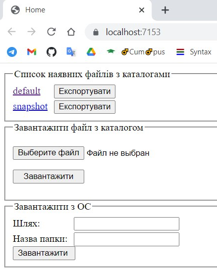
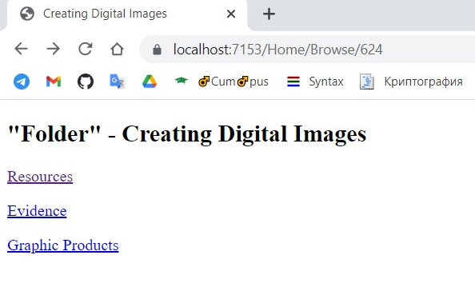

  

# Folder Browser

The project is designed to browse directory system.

Author: Ihor Nekhaienko

  

## Description

The website consists of two pages: a start page for selecting, importing and exporting json files, and a page directly for viewing the directory structure from the selected file.

Start page.

Directory browsing page.

### Browsing

To navigate through the structure, just click on the link with the json-file name, which will be uploaded to the database. The website has already contained "default.json" with the structure from the task.

### Exporting files

Using eponymous button you can download and save file.

### Importing files

For this system you are allowed to upload json-files to generate directory tree. When a file is successfully uploaded the start page will refresh and the list of available files will update. Samples of files are located in the "Tests" folder in the repository.

### Generating files

To generate directory system from OS you need to type the path of the start folder in the project structure and the name for future file. You can also send empty strings and in such way the system will generate the system based on the root folder and name it "os.json".
